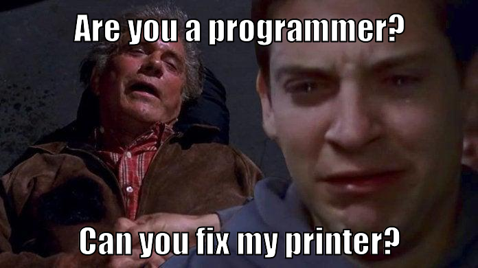

# memetor - Meme Generator

Simple script to generate memes with 2 texts, top and bottom.  
This project user docker as env to install the necessary dependencies.

like this:  
;

### Technologies
- Javascript
- Nodemon
- Dokcer
- ImageMagick

## Getting started
configure your text and image in index.js
```
git pull https://github.com/jonasalberton/memetor.git
cd memetor
docker-compose up --build
```
